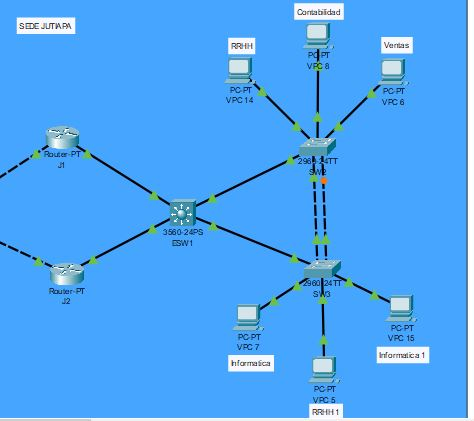
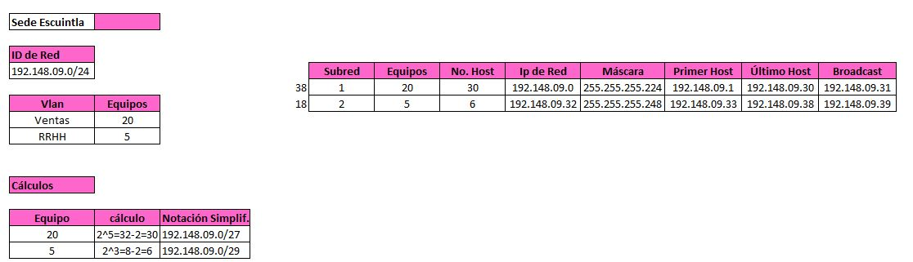

# Manual Técnico 🖥️
## Universidad de San Carlos de Guatemala
## Facultad de Ingenieria, escuela de Ciencias y Sistemas
## Redes de Computadoras 1
## PROYECTO 1
## Grupo 9️⃣

| # | Nombre                                | Carnet    |
|---|---------------------------------------|-----------|
| 1 | [Hesban Amilcar Argueta Aguilar](https://github.com/Hes-007)        | 201704787 |
| 2 | [Josué Daniel Rojché García](https://github.com/DanielGarcia-201901103)            | 201901103 |
| 3 | [Kevin Estuardo Palacios Quiñonez](https://github.com/KevinPalaciosQ)      | 201902278 |


### Proyecto 2

### Objetivos 

## Generales
Que el estudiante demuestre lo aprendido y lo ponga a prueba al crear una topología con
todo el conocimiento adquirido hasta ahora.

## Específicos
• Poner en práctica lo aprendido durante el curso.
• Demostrar el conocimiento adquirido sobre el enrutamiento entre VLANS usando
Router on a stick e interfaces virtuales.
• Demostrar el conocimiento adquirido sobre VLSM (Variable Length Subnet Mask) y
FLSM (Fixed Length Subnet Mask).
• Demostrar el conocimiento adquirido sobre los protocolos de enrutamiento
estático.

A continuación se muestra la topología propuesta en la cual se debe de realizar las configuraciones correspondients para el correcto uso de la misma.

# 🚀 **TOPOLOGÍA**: _Proyecto 2_

# 💼 **TOPOLOGÍA CORE**: _1️_ 

# ✅ **TOPOLOGÍA SEDE JUTIAPA**: _2️_ 

# 🏢 **TOPOLOGÍA SEDE ESCUINTLA**: _3️_ 

# 🚀 **TOPOLOGÍA SEDE IZABAL  **: _4_ 

# 💼 **TOPOLOGÍA PETEN**: _5_ 

# ✅ **TOPOLOGÍA SEDE QUICHE**: _6_ 

# 🏢 **TOPOLOGÍA ÁREA FIREWALL**: _7_ 


## Resumen de direcciones IP y VLAN

# ✅ **JUTIAPA**: 

# 🏢 **ESCUINTLA**:  

# 🚀 **IZABAL  **:  

# 💼 **PETEN**: 

# ✅ **QUICHE**:  


## Configuración de routers 

### Router Central
```
enable
configure terminal
no ip domain-lookup
hostname CENTRAL

interface FastEthernet0/0
ip address 10.0.0.17 255.255.255.252
 
interface FastEthernet1/0
ip address 10.0.0.21 255.255.255.252

interface FastEthernet2/0
ip address 10.0.0.25 255.255.255.252
 
interface FastEthernet3/0
ip address 10.0.0.29 255.255.255.252

interface FastEthernet4/0
ip address 10.0.0.1 255.255.255.252
 
router ospf 1
log-adjacency-changes
redistribute rip subnets 
redistribute eigrp 1 subnets 
network 10.0.0.0 0.0.0.255 area 0
```

### Router Jutiapa
```
enable
configure terminal
no ip domain-lookup
hostname JUTIAPA

interface FastEthernet0/0
ip address 11.0.0.1 255.255.255.252
 
interface FastEthernet1/0
ip address 11.0.0.5 255.255.255.252


interface FastEthernet2/0
ip address 10.0.0.34 255.255.255.252

interface FastEthernet3/0
ip address 10.0.0.38 255.255.255.252

terface FastEthernet4/0
ip address 10.0.0.42 255.255.255.252
 
interface FastEthernet5/0
ip address 10.0.0.46 255.255.255.252
 
interface FastEthernet6/0
ip address 10.0.0.2 255.255.255.252
 
router rip
version 2
redistribute eigrp 1 
network 10.0.0.0
```

### Router Escuintla
```
enable
configure terminal
no ip domain-lookup
hostname ESCUINTLA

interface FastEthernet0/0.18
encapsulation dot1Q 18
ip address 192.148.9.33 255.255.255.248

interface FastEthernet0/0.38
encapsulation dot1Q 38
ip address 192.148.9.1 255.255.255.224

interface FastEthernet1/0
ip address 10.0.0.142 255.255.255.252

interface FastEthernet2/0
ip address 10.0.0.78 255.255.255.252

interface FastEthernet3/0
ip address 10.0.0.90 255.255.255.252
 
interface FastEthernet4/0
ip address 10.0.0.10 255.255.255.252
 
interface FastEthernet5/0
ip address 10.0.0.73 255.255.255.252

router rip
version 2
network 10.0.0.0
```

### Router Izabal
```
enable
configure terminal
no ip domain-lookup
hostname IZABAL

interface FastEthernet0/0.18
encapsulation dot1Q 18
ip address 192.167.9.33 255.255.255.240

interface FastEthernet0/0.28
encapsulation dot1Q 28
ip address 192.167.9.49 255.255.255.248

interface FastEthernet0/0.38
encapsulation dot1Q 38
ip address 192.167.9.1 255.255.255.224

interface FastEthernet1/0
ip address 10.0.0.134 255.255.255.252

interface FastEthernet2/0
ip address 10.0.0.70 255.255.255.252

interface FastEthernet3/0
ip address 10.0.0.74 255.255.255.252
duplex auto
speed auto

interface FastEthernet4/0
ip address 10.0.0.6 255.255.255.252
 
interface FastEthernet5/0
ip address 10.0.0.66 255.255.255.252
 
router eigrp 1
network 10.0.0.0 0.0.0.255
auto-summary
```

### Router Petén
```
enable
configure terminal
no ip domain-lookup
hostname PETEN

interface FastEthernet0/0.18
encapsulation dot1Q 18
ip address 192.158.9.49 255.255.255.248

interface FastEthernet0/0.38
encapsulation dot1Q 38
ip address 192.158.9.1 255.255.255.224

interface FastEthernet0/0.48
encapsulation dot1Q 48
ip address 192.158.9.33 255.255.255.240

interface FastEthernet1/0
ip address 10.0.0.49 255.255.255.252
 
interface FastEthernet2/0
ip address 10.0.0.22 255.255.255.252

interface FastEthernet3/0
ip address 10.0.0.54 255.255.255.252

interface FastEthernet4/0
ip address 10.0.0.62 255.255.255.252

interface FastEthernet5/0
ip address 10.0.0.66 255.255.255.252

router eigrp 1
network 10.0.0.0 0.0.0.255
network 192.158.9.0
network 192.178.9.0
auto-summary
```

### Router Quiche
```
enable
configure terminal
no ip domain-lookup
hostname QUICHE

interface FastEthernet0/0.18
encapsulation dot1Q 18
ip address 192.178.9.97 255.255.255.240

interface FastEthernet0/0.28
encapsulation dot1Q 28
ip address 192.178.9.113 255.255.255.248

interface FastEthernet0/0.38
encapsulation dot1Q 38
ip address 192.178.9.1 255.255.255.192

interface FastEthernet0/0.48
encapsulation dot1Q 48
ip address 192.178.9.65 255.255.255.224

interface FastEthernet1/0
ip address 10.0.0.18 255.255.255.252
 
interface FastEthernet2/0
ip address 10.0.0.50 255.255.255.252
 
interface FastEthernet3/0
ip address 10.0.0.54 255.255.255.252
 
interface FastEthernet4/0
ip address 10.0.0.58 255.255.255.252
 
interface FastEthernet5/0
ip address 10.0.0.6 255.255.255.252

router eigrp 1
network 10.0.0.0 0.0.0.255
network 192.158.9.0
network 192.178.9.0
network 192.167.9.0
auto-summary
```

### Router J1
```
enable
configure terminal
no ip domain-lookup
hostname J1

interface FastEthernet0/0
ip address 192.166.9.2 255.255.255.224
duplex auto
speed auto
standby 1 ip 192.166.9.1
standby 1 priority 110
standby 1 preempt

interface FastEthernet0/0.18
encapsulation dot1Q 18
ip address 192.168.9.49 255.255.255.248

interface FastEthernet0/0.28
encapsulation dot1Q 28
ip address 192.168.9.65 255.255.255.252

interface FastEthernet0/0.38
encapsulation dot1Q 38
ip address 192.168.9.1 255.255.255.224

interface FastEthernet0/0.48
encapsulation dot1Q 48
ip address 192.168.9.33 255.255.255.240

ip classless
ip route 192.168.9.0 255.255.255.224 11.0.0.1 
ip route 192.168.9.32 255.255.255.240 11.0.0.1 
ip route 192.168.9.48 255.255.255.248 11.0.0.1 
ip route 192.168.9.64 255.255.255.252 11.0.0.1 
```

## configuración de switch capa 3

### Switch ESW1

```
hostname ESW1
ip routing
spanning-tree mode rapid-pvst

interface FastEthernet0/1
switchport trunk allowed vlan 18,28,38,48
switchport trunk encapsulation dot1q
switchport mode trunk

interface FastEthernet0/2
switchport trunk allowed vlan 18,28,38,48
switchport trunk encapsulation dot1q
switchport mode trunk

interface Vlan18
mac-address 0060.704e.2601
ip address 192.168.9.49 255.255.255.248

interface Vlan28
mac-address 0060.704e.2602
ip address 192.168.9.65 255.255.255.252

interface Vlan38
mac-address 0060.704e.2603
ip address 192.168.9.1 255.255.255.224

interface Vlan48
mac-address 0060.704e.2604
ip address 192.168.9.33 255.255.255.240
```

### Switch ESW2

```
ip routing
spanning-tree mode rapid-pvst

interface FastEthernet0/1
switchport trunk allowed vlan 18,28,38,48
switchport trunk encapsulation dot1q
switchport mode trunk

interface Vlan18
mac-address 0002.4ae1.6101
ip address 192.167.9.33 255.255.255.240

interface Vlan28
mac-address 0002.4ae1.6102
ip address 192.167.9.49 255.255.255.248

interface Vlan38
mac-address 0002.4ae1.6103
ip address 192.167.9.1 255.255.255.224
```
## configuración de switch capa 2

### Switch SW2

```
hostname SW2

interface FastEthernet0/3
switchport trunk allowed vlan 18,28,38,48
switchport mode trunk

interface FastEthernet0/10
switchport access vlan 18
switchport mode access

interface FastEthernet0/11
switchport access vlan 28
switchport mode access

interface FastEthernet0/12
switchport access vlan 38
switchport mode access
```
### Switch SW3

```
hostname SW3

interface FastEthernet0/3
switchport trunk allowed vlan 18,28,38,48
switchport mode trunk

interface FastEthernet0/10
switchport access vlan 48
switchport mode access

interface FastEthernet0/11
switchport access vlan 18
switchport mode access

interface FastEthernet0/12
switchport access vlan 48
switchport mode access
```

### Comandos empleados para la verificación del correcto funcionamiento de los protocolos empleados para la realización de la práctica.
```
do show runnning
show etherchannel summary
show vlan
show ip route
```