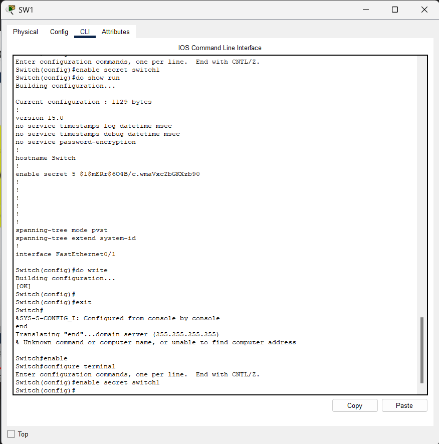

# Manual Técnico
---
### Configuración de las VPCs (una por cada área) en total 10.
> Para el calculo de las ip's se utilizaron los numeros finales de los 3 carnets: 7+3+8 = 18 y también los numeros de los niveles. Por lo que se tienen las siguientes direcciones ip.

- Para el nivel 1
    -   192.168.18.10
    -   192.168.18.11
    -   192.168.18.12
    -   192.168.18.13
    -   192.168.18.14
    -   192.168.18.15
    -   192.168.18.16
    -   192.168.18.17
    -   192.168.18.18
    -   192.168.18.19 
- Para el nivel 2
    -   192.168.18.20
    -   192.168.18.21
    -   192.168.18.22
    -   192.168.18.23
    -   192.168.18.24
    -   192.168.18.25
    -   192.168.18.26
    -   192.168.18.27
    -   192.168.18.28
    -   192.168.18.29
    -   192.168.18.211
    -   192.168.18.212 
- Para el nivel 3
    -   192.168.18.30
    -   192.168.18.31
    -   192.168.18.32
    -   192.168.18.33
    -   192.168.18.34


1. **Recursos Humanos - VPC con ip 192.168.18.12**
- nombrando VPC con ip


- Configurando ip y mascara de subred.


2. **Gerencia y Secretaría - VPC con ip 192.168.18.19**
- nombrando VPC con ip


- Configurando ip y mascara de subred.


3. **Administración - VPC con ip 192.168.18.18**
- nombrando VPC con ip


- Configurando ip y mascara de subred.


4. **Atención al cliente - VPC con ip 192.168.18.17**
- nombrando VPC con ip


- Configurando ip y mascara de subred.


5. **Oficina A - VPC con ip 192.168.18.22**
- nombrando VPC con ip


- Configurando ip y mascara de subred.


6. **Oficina B - VPC con ip 192.168.18.29**
- nombrando VPC con ip


- Configurando ip y mascara de subred.


7. **Oficina C - VPC con ip 192.168.18.24**
- nombrando VPC con ip


- Configurando ip y mascara de subred.


8. **Ventas - VPC con ip 192.168.18.30**
- nombrando VPC con ip


- Configurando ip y mascara de subred.


9. **Recepción - VPC con ip 192.168.18.31**
- nombrando VPC con ip


- Configurando ip y mascara de subred.


10. **Ti - VPC con ip 192.168.18.32**
- nombrando VPC con ip


- Configurando ip y mascara de subred.


### Pings entre los hosts 🛜 
### Realización del ping 1️⃣.

### Realización del ping 2️⃣.

### Realización del ping 3️⃣.

### Realización del ping 4️⃣.

### Realización del ping 5️⃣.


### Demostración de la captura de un paquete ARP/ICMP (solo 1 en general), incluyendo captura de pantalla. 

A continuación se presenta el envío de un paquete de la VPC de administración (192.168.18.18) hacia la VPC perteneciente a la oficina C (192.168.18.23):


Como se puede observar en la siguiente imagen, los se utilizarón los protocolos ICMP y ARP. El protocolo ICMP es un protocolo de red que su funcion es realizar envios de mensajes de control es este caso en la red entre oficinas, esto con el proposito de verificar si las VPC tienen conectividad entre si. El color del paquete se identifica con el color azul:


De la misma manera se utilizó el protocolo ARP que es utilizado para mapear direcciones IP a direcciones MAC que es esencial para la comunicación en la capa de enlace de datos, en pocas palaras estre protocolo se utiliza para traducir direcciones IP a direcciones MAC, que son necesarias en la capa de enlace de datos para enviar paquetes a traves de nuestra red. El color del paquete enviado es verde: 


Al ejecutar el simulador, se comienzan a enviar los paquetes y se puede observar el flujo de envío:


---
### Configuración de switches
Para la configuración de los switches se utilizaron los comandos 
```
enable
configure terminal
enable secret numerodeswitch "el comando enable secret fue utilizado para establecer una contraseña "
do write
do write memory
do copy running-config startup-config
exit
exit
```
# Configuración del Switch1

# Configuración del Switch1 Parte 2

# Login del Switch1

# Configuración del Switch2

# Login del Switch2

# Configuración del Switch3

# Login del Switch3

